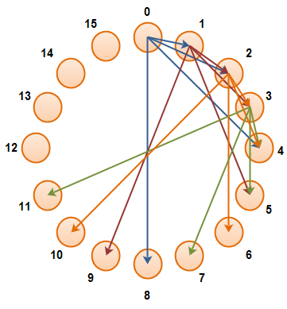

# Architecture of the p2p chat application

This document contains a discussion on the fundamental ideas behind overcomming the challenges faced by this peer-to-peer system. It should be used as a reference before making any significant changes.

## Challenges in a peer-to-peer implementation and possible solutions

### Issues
1. Discovery of a first node without a dedicated relay server.
2. Connecting to clients behind a Symmetric NAT.
3. Connecting to clients behind a Randomized NAT.
4. Building routing tables so that each client .doesn't have to know about every other client.
5. Maintaining a secure contact list
6. Secure p2p communication for messaging and calls

### Solutions

1. Use DDNS to ensure that an outside node can always connect to a currently active node. The nodes mapped to the domain name run server sockets with keep alive packets to make a hole in the NAT. This does mean only certain clients will be able to serve this purpose.
2. Use TCP hole punching
3. Use a node with either a public ip or a hole punched address known by both peers to relay information
4. Use an XOR distance of a GUID and only store clients exponentially further away.
5. Only distribute public keys to trusted peers and use encrypted id whenever communication identification is needed between two peers
6. Attempt to get a direct connection without a relay. If this is not possible use one time keys to encrypt communication syncronisly.

## Solutions to Issues in greater detail
### 1. DDNS

By using DDNS a new host can obtain the IP address of the node which will serve as its entry point to the network.

If a host is suitable to serve as an entry node it will become the next entry point after it has joined the network and obtained routing information from the node that it used to join the network.

For a host to be suitable for use as an entry node it needs to either be available from a public IP address or be behind a nat that forwards all trafic from a port to an internal client, regardless of who the external client is.This requires the use of UDP hole punching to make a hole in the firewall and keep it alive by occasionally sending UDP packets out on this port.

To avoid the case where all entry points go down without having updated the DNS records, all hosts that can serve as an entry point. Check that the current entry points are still up at fixed intervals. If an entry point url is found to be down the host that found it will make itself the new entry point.

### 2. UDP hole punching and connecting to other hosts

This is done by first send a UDP packet on the port where the TCP serversocket will be running to the IP address that will be connecting to it. The the UDP socket is then closed and a TCP serversocket is opened on the same port to make sure the nat will route inbound connections to it. Then the host will notify the other party that it should connect to it on its public IP address and opened port.

For new clients this is done by a UDP packet to the entry point. For establishing direct communication for calls and messages this is done by a broadcast through the network, however the host needs to first discover the external port that its serversocket is running on to be able to inform the other party. This port identity check is not required for new connections as the entry point can extract this from the requesting packet. 

### 3. Relays

Suitable nodes will be used as relays if both hosts are incapable of hosting a serversocket to facilitate direct communication. This is however a fallback method and will only be used with the users consent as it will not be directly peer to peer. It will also be possible to disable this feature altogether if a user wishes to do so for privace reasons.

### 4. Routing

We will build an routing table based on exponential GUID distances. This leads requiring Log(N) space meaning even a million hosts will require storing only 19 connections per each host. This is also the maximum hop distance to establish a connection in this network.

In addition we will also store a certain number of recently contacted hosts to enable situations like a bunch of text messages in short succesion to be able to occur without having to set up and tear down a connection for each message.

### 5. Encryption

Each host will generate a random rsa keypair as well as a unique ID. The public key and an encrypted version of its unique id will be given to users when they are added as contacts. Both of these can be regenerated at any time and the user can select who on their contact list to redistribute this information to.

Public-Private key encryption is used throughout the message passing that occurs in the network in order to set up direct SSL connections between clients.

All message that the user want to send to another user will travel only via a direct SSL channel with no hosts in between.

### 6. Message passing and Calling

Message passing happens via a direct SSL link between the two hosts and calling will happend via encrypted UDP.

To set up an SSL connection to send a connection the receiver must be in the client's contact list.
The sender then encrypts the receivers id and its current IP and port number with the reveivers public key. This is then broadcast to the senders direct peers with a TTL corresponding to the amount of host on the network. When the message arrives at any host it will attempt to decrypt it. If it can't it sends it on until the message reaches the intended receiver or the TTL reaches 0.

If the receiver succesfully decrypts the message and finds its own ID it will attempt to connect to the sender and they will then use the new SSL socket for further communication.

The same happens for establishing a call. However the SSL socket is then used purely for establishing symmetric key encryption for the dureation of the call. The UDP sockets are then opened on both hosts and all audio packets are then encrypted with the symmetric key. Ending the call is also signalled via the SSL socket.